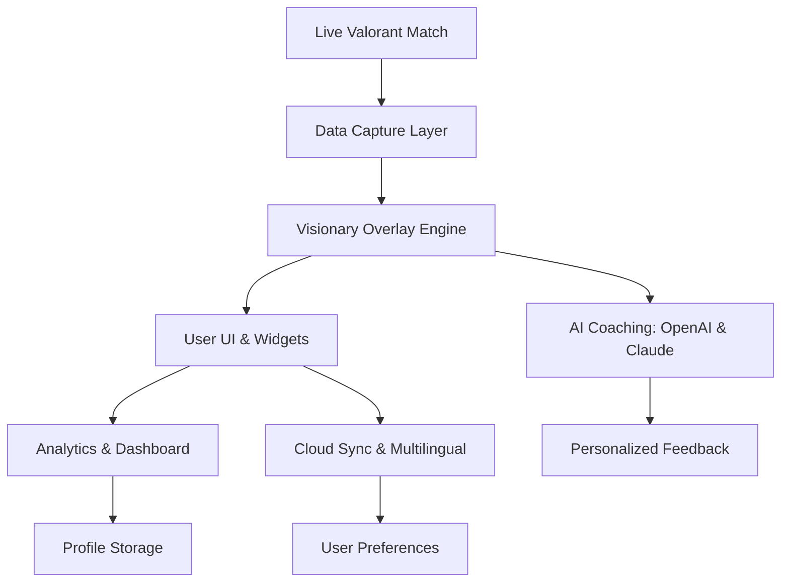

# VALORANT Visionary Suite 💡🎮

Full Visibility, Strategic Power: Next-Gen Overlay & Analytics Toolkit for Valorant 2026

---

Welcome to **VALORANT Visionary Suite 3.0** – The Ultimate External Overlay & Strategic Companion for Valorant!  
Unleash a futuristic layer of real-time analytics, coaching overlays, team-based radar, and tailor-made player insights. Constructed for 2026 and beyond, this project rejuvenates professional and enthusiast Valorant gameplay with creative augmentations, never touching the game’s core files.

> ***Elevate your experience:*** From deep match statistics to real-time strategy visuals and multilingual guidance, empower each round with a novel vantage on competitive tactics.

---

## 🦾 What is VALORANT Visionary Suite?

VALORANT Visionary Suite is an advanced, external solution designed for *strategists, streamers, teams, and training organizations*. It safely overlays a hub of performance analytics, radar intelligence, and AI-powered feedback on top of live Valorant matches. This suite harnesses live data feeds and integrates with OpenAI & Claude AI for coaching, smart notifications, and adaptive UI elements—all without modifying or interfering with the game itself.

---

## 😎 Key Features 2026

- **Live Tactical Overlay**: Radar, team utility cooldowns, and agent-specific tips.
- **AI Coaching Bot**: Powered by OpenAI and Claude API, delivers adaptive suggestions, post-game breakdowns, and real-time strategy cues.
- **Player Profile Analytics**: Visual graphs, heatmaps, and session tracking for your Valorant career.
- **Responsive UI**: Automatically adjusts for any screen/resolution.
- **Multilingual Support**: 18+ languages, including Spanish, Portuguese, Japanese, Turkish, and Arabic.
- **Customizable Dashboard**: Personalize info widgets, color schemes, and placement.
- **Cloud Profile Syncing**: Store and retrieve setup profiles across devices.
- **Cross-Platform**: Full compatibility with major Windows, macOS, and selected Linux environments.
- **24/7 NextGen Support**: Dedicated support platform with AI triage and live guides.
- **Privacy Controls**: Fully compliant with all applicable data privacy standards—your gameplay, your data.

---

## 📃 Example Profile Configuration

Example of a user profile config (YAML format):

    # VALORANT-VISIONARY 3.0 Profile
    profile_name: "TacticianPro"
    language: "en"
    overlays:
      radar: true
      cooldown_tracker: true
      agent_tips: false
    ai_coaching:
      enabled: true
      preferred_ai: "OpenAI"
      feedback_style: "concise"
    notifications:
      performance_alerts: true
      match_summary: true
    analytics:
      store_sessions: true
      cloud_sync: true
    privacy:
      telemetry: false
      crash_reports: false

---

## 💬 Example Console Invocation

CLI tools for advanced users and automation pipelines:

    valorant_visionary.exe --profile="TacticianPro" --lang="en" --coach
    # or
    ./valorant_visionary --profile-path=~/VisionaryProfiles/AwperKing.yaml --fullscreen

---

## 🌎 OS Compatibility Table

| OS              | Supported | Auto-Scaling UI | Cloud Sync | AI Coaching |
|-----------------|:---------:|:---------------:|:----------:|:-----------:|
| Windows 10/11   |   ✅      |       ✅        |     ✅      |     ✅      |
| macOS (M*)      |   ✅      |       ✅        |     ✅      |     ✅      |
| Linux (Ubuntu)  |   🚧      |     Limited     |     ✅      |     Partial |
| Steam Deck      |   🚧      |     Partial     |     🚧     |     Partial |

--- 

## 🕵️ Feature List

- 💡 *Dynamic Radar Overlay*: See real-time teammate positions, map callouts, and spike tracking.
- 🧠 *AI-Driven In-Game Coach*: Get custom feedback and on-the-fly suggestions for ability use and rotations.
- 🎬 *Streamer Mode*: Auto anonymization and display-safe overlays.
- 🖥️ *Advanced Analytics Workspace*: Analyze K/D, win rate by agent, peak hours, and session summary.
- 🌐 *Multi-Language Locales*: Seamless switching in-session.
- 🔖 *Modular Overlays*: Toggle and resize widgets to minimize distractions.
- 🔗 *Profile Export/Import*: Share strategies with friends and teams.
- ⏲️ *Live Cooldown Timers*: Sharpen timing on smokes, flashes, and enemy utility.
- 🚦 *Privacy-First Telemetry*: All analytics opt-in, with transparent controls.

--- 

## ⚡️ SEO-Integrated: Why Use VALORANT Visionary Suite?

Searching for the best Valorant overlay tool in 2026? Want safe, anti-ban strategy augmentation for professional or streaming usage? Our toolkit is engineered for maximum game-legal safety, powerful AI analysis, and cross-platform support—perfect for tactical edge, performance analysis, and next-level content creation.  
Combine real-time Valorant external overlays, AI-powered coaching, multilingual guidance, and robust analytics to unlock your strategic potential.

---

## 🤖 OpenAI & Claude API Integration

- **Chat-based Suggestions:** Get on-demand, live strategy from GPT-4 and Claude 3 direct in your overlay sidebar.
- **Feedback Summaries:** Post-match analytics and recommendations from AI models.
- **Auto-Language Detection:** AI chooses preferred language for comments and coaching.
- **Customizable Prompts:** Adjust the frequency, tone, and type of feedback you receive.

*API keys are securely handled; credentials stored locally and never shared.*

---

## 🖌️ Mermaid Diagram: Vision Flow

---

## ⚠️ Disclaimer

VALORANT Visionary Suite is a productivity, analytics, and strategy overlay designed **exclusively for legitimate, personal use**. This project **does not inject, modify, or alter any Valorant game files or memory**, and all overlays are implemented with strict separation from the game client. Use of this suite is at your own discretion; users are responsible for ensuring compliance with all applicable game and service terms.  
VALORANT, Riot Games, and all associated logos are trademarks of their respective owners.

---

## 📜 License: MIT

This repository is open source, licensed under the MIT License (© 2026). See [LICENSE](./LICENSE) for details.

---

## 🚀 Quick Start & Download

Download the latest stable build for your platform:

See the docs/INSTALL.md for advanced setup and troubleshooting.

---

Ready to transform your Valorant tactical gameplay?  
Unlock the next level of analysis and strategy with **VALORANT Visionary Suite 3.0**!  
Stay visionary. Stay ahead.